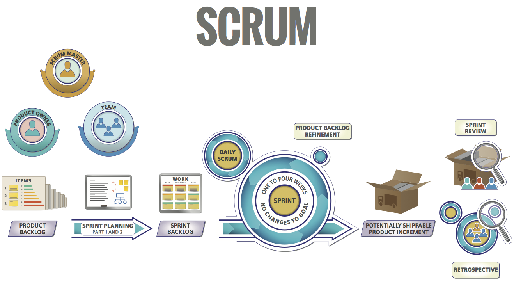
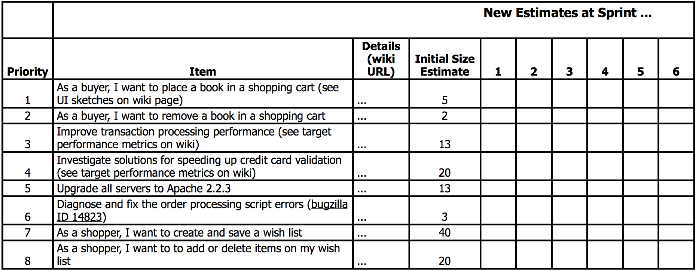
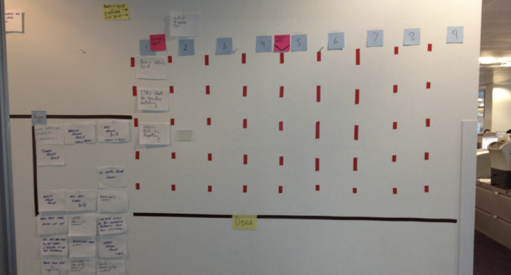
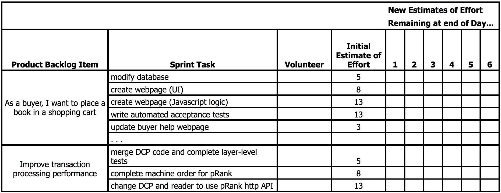
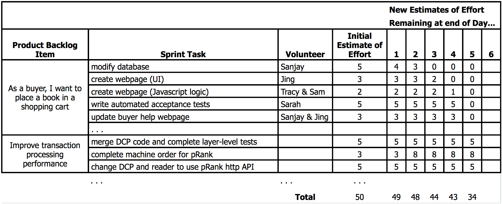
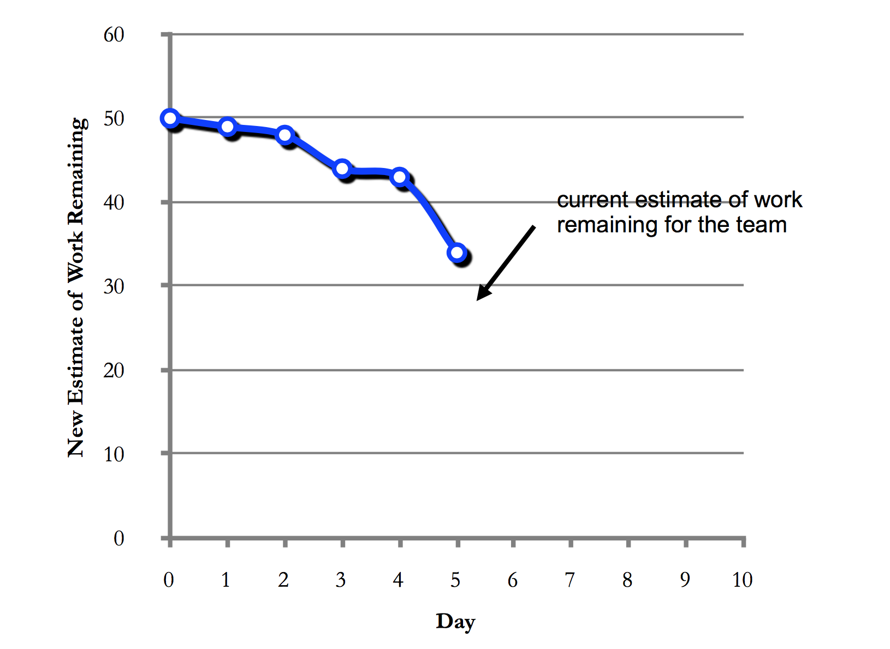
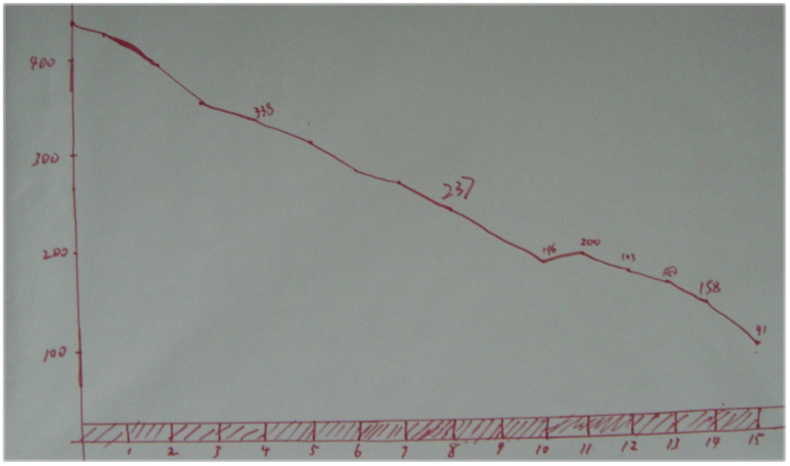
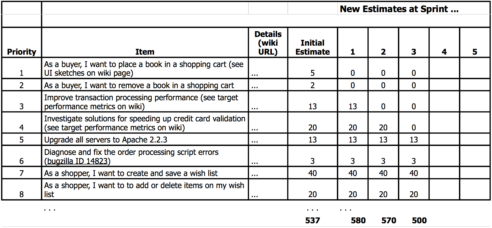

---
title: 
- type: main
  text: The Scrum Primer
creator:
- role: author
  text: Pete Demer
- role: author
  text: Gabrielle Benefield
- role: author
  text: Craig Larman
- role: author
  text: Bas Vodde
...

<b>A Lightweight Guide to the Theory and Practice of Scrum</b>

Version 2.0

A note to readers: There are many concise descriptions of Scrum available
online, and this primer aims to provide the next level of detail on the
practices. It is not intended as the final step in a Scrum education; teams that
are considering adopting Scrum are advised to equip themselves with Ken
Schwaber’s [Agile Project Management with Scrum](https://www.amazon.com/Agile-Project-Management-Scrum-first/dp/B004PRXV28/)
or, Mike Cohn’s [Succeeding with Agile](http://www.amazon.com/Succeeding-Agile-Software-Development-Using/dp/0321579364)
and take advantage of the many excellent Scrum training and coaching
options that are available; full details are at [scrumalliance.org](https://www.scrumalliance.org/).
Our thanks go to Ken Schwaber, Dr. Jeff Sutherland, and Mike Cohn for their generous input.

The latest version of the Primer can be found at:
<http://www.infoq.com/minibooks/Scrum_Primer>.
Translations can be found at: <http://www.scrumprimer.org/>.

© 2012 Pete Deemer, Gabrielle Benefield, Craig Larman, Bas Vodde

# Beyond Traditional Development

Traditional development with single-function groups, delayed or weak feedback
loops, front-loaded predictive planning, and a sequential flow from analysis to
test is not very successful in today’s volatile world. This approach delays
feedback, learning, and potential return on investment due to an absence of real
working software until late in the game, causing a lack of transparency, lack of
ability to improve, reduction in flexibility, and an increase in business and
technical risks. 

An alternative -- cross-functional teams with iterative development -- has also
existed for decades, but was not as widely used as the traditional model.

Scrum packages proven product-development concepts in a simple framework,
including: real teams, cross-functional teams, self-managing teams, short
iterative full-cycle feedback loops, and lowering the cost of change. These
concepts increase agility and feedback, enable earlier ROI, and reduce risk.

# Overview

Scrum is a development framework in which cross-functional teams develop
products or projects in an iterative, incremental manner. It structures
development in cycles of work called **Sprints**. These iterations are no more than
four weeks each (the most common is two weeks), and take place one after the
other without pause. The Sprints are *timeboxed* -- they end on a specific date
whether the work has been completed or not, and are *never extended*. Usually
Scrum Teams choose one Sprint length and use it for all their Sprints until they
improve and can use a shorter cycle. At the beginning of each Sprint, a
*cross-functional* **Team** (of about seven people) selects **items** (customer
requirements) from a prioritized list. The Team agrees on a collective target of
what they believe they can deliver by the end of the Sprint, something that is
tangible and will be truly "done".  During the Sprint, no new items may be
added; Scrum embraces change for the next Sprint, but the current short Sprint
is meant to focus on a small, clear, relatively stable goal. Every day the Team
gathers briefly to inspect its progress, and adjust the next steps needed to
complete the work remaining. At the end of the Sprint, the Team reviews the
Sprint with stakeholders, and demonstrates what it has built. People obtain
feedback that can be incorporated in the next Sprint. Scrum emphasizes working
product at the end of the Sprint that is really “done”; in the case of software,
this means a system that is integrated, fully tested, end-user documented, and
potentially shippable. Key roles, artifacts, and events are summarized in Figure 1.

A major theme in Scrum is "inspect and adapt." Since development inevitably
involves learning, innovation, and surprises, Scrum emphasizes taking a short
step of development, inspecting both the resulting product and the efficacy of
current practices, and then adapting the product goals and process practices.
*Repeat forever.*

# Scrum Roles

In Scrum, there are three roles: Product Owner, Team, and ScrumMaster.
Together these are known as the Scrum Team.

The **Product Owner** is responsible for maximizing return on investment (ROI)
by identifying product features, translating these into a prioritized list,
deciding which should be at the top of the list for the next Sprint, and
continually re-prioritizing and refining the list. The Product Owner has profit
and loss responsibility for the product, assuming it is a commercial product. In
the case of an internal application, the Product Owner is not responsible for
ROI in the sense of a commercial product (that will generate revenue), but they
are still responsible for maximizing ROI in the sense of choosing -- each Sprint
-- the highest-value items. In practice, ‘value’ is a fuzzy term and
prioritization may be influenced by the desire to satisfy key customers,
alignment with strategic objectives, attacking risks, improving, and other
factors.  In some cases, the Product Owner and the customer are the same person;
this is common for internal applications. In others, the customer might be
millions of people with a variety of needs, in which case the Product Owner role
is similar to the Product Manager or Product Marketing Manager position in many
product organizations. However, the Product Owner is somewhat different than a
traditional Product Manager because they actively and regularly interact with
the Team, prioritize by working with all of the stakeholders and reviewing the
results each Sprint, rather than delegating development decisions to a project
manager. It is important to note that in Scrum there is one and only one person
who serves as – and has the final authority of – Product Owner, and he or she is
responsible for the value of the work; though that person doesn’t have to work
alone.

The **Team (also called Development Team)** builds the product that the Product
Owner indicates: the application or website, for example. The Team in Scrum is
“cross-functional” -- it includes all the expertise necessary to deliver the
potentially shippable product each Sprint -- and it is “self-organizing”
(self-managing), with a very high degree of autonomy and accountability. The
Team decides how many items (from the set offered by the Product Owner) to build
in a Sprint, and how best to accomplish that goal .

Each member of the Team is just a *team member*. Notice there are no fixed
specialist titles in a group that adopts Scrum; there is no business analyst, no
DBA, no architect, no team lead, no interaction/UX designer, no programmer. They
work together during each Sprint in whatever way is appropriate to achieve the
goal they have set for themselves.

Since there are only *team members*, the Team is not only cross-functional but
also demonstrates *multi-learning*: each person certainly has special strengths,
but also continues to learn other specialties. Each person will have primary,
secondary and even tertiary skills, and is meant to “go to where the work is”;
individuals take on tasks in less familiar areas to help complete an item. For
example, a person whose primary skill is interaction design could have a
secondary skill in automated testing; someone with primary skill in technical
writing might also help with analysis and programming.

The Team in Scrum is seven plus or minus two people, and for a software product
the Team might include people with skills in analysis, development, testing,
interface design, database design, architecture, documentation, and so on. The
Team develops the product and provides ideas to the Product Owner about how to
make the product great. In Scrum the Teams are most productive and effective if
all members are 100 percent dedicated to the work for one product during the
Sprint; the Team avoids multi-tasking across multiple products or projects, to
avoid the costly drain of divided attentions and context-switching. Stable teams
are associated with higher productivity, so avoid changing Team members. Product
groups with many people are organized into multiple Teams, each focused on
different features for the product, with close coordination of their efforts.
Since one team often does all the work (planning, analysis, programming, and
testing) for a complete customer-centric feature, Teams are also known as
*feature teams*.

The **ScrumMaster** helps the product group learn and apply Scrum to achieve
business value.  The ScrumMaster does whatever is in their power to help the
Team, Product Owner and organization be successful. The ScrumMaster is *not* the
manager of the Team members, nor are they a project manager, team lead, or team
representative.  Instead, the ScrumMaster *serves* the Team; he or she helps to
remove impediments, protects the Team from outside interference, and helps the
Team to adopt modern development practices. He or she educates, coaches and
guides the Product Owner, Team and the rest of the organization in the skillful
use of Scrum. The ScrumMaster is a *coach* and *teacher*. The ScrumMaster makes
sure everyone (including the Product Owner, and those in management) understands
the principles and practices of Scrum, and they help lead the organization
through the often difficult change required to achieve success with agile
development.  Since Scrum makes visible many impediments and threats to the
Team’s and Product Owner’s effectiveness, it is important to have an engaged
ScrumMaster working energetically to help resolve those issues, or the Team or
Product Owner will find it difficult to succeed.  There should be a dedicated
full-time ScrumMaster, although a smaller Team might have a team member play
this role (carrying a lighter load of regular work when they do so). Great
ScrumMasters can come from any background or discipline: Engineering, Design,
Testing, Product Management, Project Management, or Quality Management. 

The ScrumMaster and the Product Owner cannot be the same individual as their
focus is so different and combining them often leads to confusion and conflict.
One common unfortunate result of combining these roles is a micro-managing
Product Owner which is opposite to self-managing teams that Scrum requires.
Unlike a traditional manager, the ScrumMaster does not tell people what to do or
assign tasks – they facilitate the process, supporting the Team as it organizes
and manages itself. If the ScrumMaster was previously in a position managing the
Team, they will need to significantly change their mindset and style of
interaction for the Team to be successful with Scrum.

Note: there is no role of project manager in Scrum at all.  This is because none
is needed; the traditional responsibilities of a project manager have been
divided up and reassigned among the three Scrum roles, and mostly to the Team
and Product Owner, rather than to the ScrumMaster.  Practicing Scrum with the
addition of a project manager indicates a fundamental misunderstanding of Scrum,
and typically results in conflicting responsibilities, unclear authority, and
sub-optimal results.  Sometimes an (ex-)project manager can step into the role
of ScrumMaster, but the success of this approach is heavily dependent on the
individual, and how well they understand the fundamental difference between the
two roles, both in the day-to-day responsibilities and in the mindset required
to be successful.  A good way to understand thoroughly the role of the
ScrumMaster, and start to develop the core skills needed for success, is to
attend the Scrum Alliance’s Certified ScrumMaster training.

In addition to these three roles, there are other stakeholders who contribute to
the success of the product, including managers, customers and end-users. Some
stakeholders such as functional managers (for example, an engineering manager)
may find their role, while still valuable, change when adopting Scrum.
For example:

- they support the Team by respecting the rules and spirit of Scrum
- they help remove impediments that the Team and Product Owner identify
- they make their expertise and experience available

In Scrum, these individuals replace the time they previously spent playing the
role of “nanny” (assigning tasks, getting status reports, and other forms of
micromanagement) with time as “guru” and “servant” of the Team (mentoring,
coaching, helping remove obstacles, helping problem-solve, providing creative
input, and guiding the skills development of Team members). In this shift,
managers may need to change their management style; for example, using Socratic
questioning to help the Team discover the solution to a problem, rather than
simply deciding a solution and assigning it to the Team.

# Product Backlog

When a group is planning to transition to Scrum, before the first Sprint can
begin, they need a **Product Backlog**, a prioritized (ordered 1, 2, 3, ...) list of
customer-centric features.

The Product Backlog exists (and evolves) over the lifetime of the product; it is
the product roadmap (Figure 2 and Figure 3). At any point, the Product Backlog
is the single, definitive view of “everything that could be done by the Team
ever, in order of priority”. Only a single Product Backlog exists for a product;
this means the Product Owner is required to make prioritization decisions across
the entire spectrum, representing the interests of stakeholders (including the Team).

The Product Backlog includes a variety of **items**, primarily new customer
features (“enable all users to place book in shopping cart”), but also *major*
engineering improvement goals (e.g., “rewrite the system from C++ to Java”),
improvement goals (e.g. “speed up our tests”), research work (“investigate
solutions for speeding up credit card validation”), and, possibly, known defects
(“diagnose and fix the order processing script errors”) if there are only a few
problems.  (A system with many defects usually has a separate defect tracking
system.) 

Product Backlog items are articulated in any way that is clear and sustainable.
Contrary to popular misunderstanding, the Product Backlog does *not* contain
“user stories”; it simply contains *items*. Those items can be expressed as user
stories, use cases, or any other requirements approach that the group finds
useful. But whatever the approach, most items should focus on delivering value
to customers.

A good Product Backlog is DEEP.

**Detailed appropriately**. The top priority items are more fine-grained and
detailed than the lower priority items, since the former will be worked on
sooner than the latter. For example, the top 10% of the backlog may be composed
of very small, well-analyzed items, and the other 90% much less so.

**Estimated**. The items for the current release need to have estimates, and
furthermore, should be considered for re-estimation each Sprint as everyones
learns and new information arises. The Team provides the Product Owner with
*effort* estimates for each item on the Product Backlog, and perhaps also
*technical risk* estimates. The Product Owner and other business stakeholders
provide information on the value of the product  requests, which may include
revenue gained, costs reduced, business risks, importance to various
stakeholders, and more.

**Emergent**. In response to learning and variability, the Product Backlog is
regularly refined. Each Sprint, items may be added, removed, modified, split,
and changed in priority. Thus, the Product Backlog is continuously updated by
the Product Owner to reflect changes in the needs of the customer, new ideas or
insights, moves by the competition, technical hurdles that appear, and so forth. 

**Prioritized**. The items at the top of the Product Backlog are prioritized or
*ordered* in a 1-N order. In general, the highest-priority items should deliver
the most *bang for your buck*: lots of bang (business value) for low buck (cost).
Another motivation to increase the priority of an item is to *tackle high risks
early, before the risks attack you*.

Traditional development does not usually emphasize delivering according to
highest *bang for your buck*, but this is a theme of Scrum, and therefore the
Product Owner will need to learn how to assess the bang of “business value.”
This is something the ScrumMaster may help the Product Owner learn. What does
“business value” mean? Some product groups use a simple relative value-point
estimate for each Product Backlog item which synthesizes a “guesstimate” of
factors including revenue gain, cost reduction, stakeholder preferences, market
differentiation, and so forth. Some fund a specific item by one or more
customers paying for its development and so use that item's exact (short term)
revenue as a proxy for value. For other groups such item-specific value
estimation is too unfocused or granular; they apply a broader
business-outcome-based approach ("increase subscriptions by 10% by September 1")
in which value is only delivered when multiple outcome-contributing items are
delivered together. In that case, the Product Owner needs to define the next
increment of Minimum Viable Product.

For effort estimates, a common technique is to estimate in terms of relative
size (factoring in effort, complexity, and uncertainty) using a unit of “story
points” or simply “points”.

These are just suggestions; Scrum does not define the technique for expressing
or prioritizing items in the Product Backlog and it does not define the
estimation technique or units.

A common technique used in Scrum is to track how much work it completes each
Sprint; for example, averaging 26 points completed per Sprint. With this
information they can project a release date to complete all features, or how
many features can be completed by a fixed date, if the average continues and
nothing changes.  This average is called the “velocity.” Velocity is expressed
in the same units as the Product Backlog item size estimates.

The items in the Product Backlog can vary significantly in size or effort.
Larger ones are broken into smaller items during the Product Backlog Refinement
workshop or the Sprint Planning Meeting, and smaller ones may be consolidated.
The Product Backlog items for the upcoming next several Sprints should be small
and fine-grained enough that they are understood by the Team, enabling forecasts
made in the Sprint Planning meeting to be meaningful; this is called an
“actionable” size.

Major engineering improvements that consume much time and money should be in the
Product Backlog, since they may be an optional business investment, ultimately
to be made by the business-oriented Product Owner. Note that in Scrum, the Team
has independent authority of how many items from the Product Backlog they decide
to take into a Sprint, so they are independently free to take on minor
engineering improvement work as they can be considered part of the normal cost
of doing business and what is required for a developer to do their job properly.
That said, in each Sprint, the *majority* of a Team’s time should usually be on
Product Owner goals, not internal engineering tasks.

One of the myths about Scrum is that it prevents you from writing detailed
specifications; in reality, it is up to the Product Owner and Team to decide how
much detail is required, and this will vary from one backlog item to the next,
depending on the insight of the Team, and other factors. State what is important
in the least amount of space necessary -- in other words, do not describe every
possible detail of an item, just make clear what is necessary for it to be
understood, and augment this with continuous dialog between the Team and Product
Owner and stakeholders. Low priority Product Backlog Items, which will not be
worked on for some time, are usually “coarse grained” (large, with less-detailed
requirements). High priority and fine-grained Product Backlog Items that will
soon be implemented tend to have more detail.

# Definition of Done

The output of every Sprint is officially called a Potentially Shippable Product
Increment. Before starting the first Sprint, the Product Owner, Team, and
ScrumMaster have to review what is all needed for a Product Backlog item to be
potentially shippable. All activities that are needed in order to ship the
product should be included in the definition of Potentially Shippable and
therefore should be done during the Sprint.

Unfortunately, when Teams start using Scrum, they are often not able to achieve
the goal of delivering a Potentially Shippable Increment every Sprint. This is
often because the team lacks in automation or isn’t cross-functional enough
(e.g. the technical writers aren’t included in the cross-functional Team yet).
Over time, the Team has to improve so they will be able to deliver a Potentially
Shippable Product Increment every Sprint, but in order to start, they will need
to create a baseline of their existing capabilities. This is recorded in the
Definition of Done.

Before the first Sprint, the Product Owner and Team need to agree on a
Definition of Done, which is a subset of the activities that are needed for
creating a Potentially Shippable Product Increment (for a good Team, it will be
the same). The Team will plan their Sprint work according to this Definition of
Done.

A good Product Owner will always want the Definition of Done to be as close as
possible to Potentially Shippable as that will increase the transparency in the
development and decrease *delay and risk*. If the Definition of Done is not
equal to Potentially Shippable, then work is delayed until before the release
which causes this *risk and delay*. This delayed work is sometimes called
*undone work*.

A Scrum Team should continuously improve, which is reflected in extending their
Definition of Done.

# Sprint Planning 

**Summary**: A meeting to prepare for the Sprint, typically divided into two
parts (part one is “what” and part two is “how”).  
**Participants**: Part One: Product Owner, Team, ScrumMaster. Part Two: Team,
ScrumMaster, Product Owner (optional but should be reachable for questions)  
**Duration**: Each part is timeboxed to one hour per week of Sprint.

At the beginning of each Sprint, the **Sprint Planning Meeting** takes place. It
is divided into two distinct sub-meetings, the first of which is called
**Sprint Planning Part One**.

In Sprint Planning Part One, the Product Owner and Team review the high-priority
items in the Product Backlog that the Product Owner is interested in
implementing this Sprint. Usually, these items will have been well-analyzed in a
previous Sprint (during Product Backlog Refinement), so that at this meeting
there are only minor last-minute clarifying questions.  In this meeting, the
Product Owner and Team discuss the goals and context for these high-priority
items on the Product Backlog, providing the Team with insight into the Product
Owner’s thinking. Part One focuses on understanding *what* the Product Owner wants
and *why* they are needed. At the end of Part One the (always busy) Product Owner
may leave although they must be available (for example, by phone) during Part
Two of the meeting. 

In Part One, the Team and the Product Owner may also devise the **Sprint Goal**.
This is a summary statement of the Sprint objective, which ideally has a
cohesive theme. The Sprint Goal also gives the Team scope-flexibility regarding
what they may actually deliver, because although they may have to remove some
item (since the Sprint is timeboxed), they should nevertheless commit to
delivering something tangible and “done” that is in the spirit of the Sprint
Goal. 

How big should the items be that are taken on in a Sprint? Each item should be
split small enough so that it is estimated to require considerably less than the
whole Sprint. A common guideline is that an item is estimated small enough to
complete within one fourth or less of a Sprint by the whole Team.

**Sprint Planning Part Two** focuses on *how* to implement the items that the Team
decides to take on. The Team forecasts the amount of items they can complete by
the end of the Sprint, starting at the top of the Product Backlog (in others
words, starting with the items that are the highest priority for the Product
Owner) and working down the list in order. *This is a key practice in Scrum: The
Team decides how much work it will complete, rather than having it assigned to
them by the Product Owner*. This makes for a more reliable forecast because the
Team is making it based on its own analysis and planning. While the Product
Owner does not have control over how much the Team signs up for, he or she knows
that the items are drawn from the top of the Product Backlog -- in other words,
the items that he or she has rated as most important. The Team has the ability
to lobby for items from further down the list; this usually happens when the
Team and Product Owner realize that something of lower priority fits easily and
appropriately with the high priority items.

The Sprint Planning Meeting will often last several hours, but no more than four
hours for a two-week Sprint -- the Team is making a serious forecast to complete
the work, and this requires careful thought to be successful. Part One and Part
Two are of equal timeboxed lengths; for a two-week Sprint each part is two hours
maximum.

Scrum does not define how to exactly do Sprint Planning Part Two.  Some teams
use their velocity from the previous Sprints to guide how much to aim for.
Other teams will use a more fine-grained approach of first calculating their
capacity.

When using the capacity approach, the Team, in Sprint Planning Part Two,
calculates how much time each team member has for Sprint-related work. Most
teams assume that the team members can only focus on Sprint-related work for 4-6
hours per day -- the rest of the time goes to email, lunch breaks, facebook,
meetings, and drinking coffee . Once the capacity is determined, the Team needs
to figure out how many Product Backlog items they can complete in that time, and
how they will go about completing them.  This often starts with a design
discussion at a whiteboard.  Once the overall design is understood, the Team
decomposes the Product Backlog items into fine-grained work.  Before taking the
Product Backlog items, the Team may focus on generating tasks for an improvement
goal created in the previous Sprint’s Retrospective. Then, the Team selects the
first item on the Product Backlog – the Product Owner’s highest priority
item  – and work their way down until they are ‘full’. For each item they create
a list of work which consists of either decomposed Product Backlog items into
tasks or, when the Product Backlog item are so small they would only take a
couple hours to implement, simply the Product Backlog item. This list of work to
be done during the Sprint is called the *Sprint Backlog* (Figure 4 and Figure 5).

At the end of the Sprint Planning Meeting, the Team sets a realistic target for
what they believe they can deliver by the end of the Sprint. Traditionally, this
was called a Sprint Commitment -- the team commits to doing the best they can to
reach their target. Unfortunately, this was sometimes misinterpreted as a
written-in-blood promise rather than the team seriously “going for it.” To avoid
this confusion, the sprint-target is now called a ‘forecast” which is
communicated to the Product Owner.

Scrum encourages multi-skilled workers, rather than only “working to job title”
such as a “tester” only doing testing. In other words, Team members “go to where
the work is” and help out as possible. If there are many testing tasks, then
*all* Team members may help. This does not imply that everyone is a generalist;
no doubt some people are especially skilled in testing (and so on) but Team
members work together and learn new skills from each other. Consequently, during
task generation and estimation in Sprint Planning, it is not necessary -- nor
appropriate -- for people to volunteer for all the tasks “they can do best.”
Rather, it is better to only volunteer for one task at a time, when it is time
to pick up a new task, and to consider choosing tasks that will on purpose
involve learning (perhaps by pair work with a specialist). This is one reason
for not pre-assigning tasks during Sprint Planning, rather this should be done
on an ‘as needed’ basis during the Sprint.

All that said, there are *rare* times when John may do a particular task because
it would take far too long or be impossible for others to learn -- perhaps John
is the only person with any artistic skill to draw pictures. Other Team members
could not draw a “stick man” if their life depended on it. In this rare case --
and if it is not rare and not getting rarer as the Team learns, there is
something wrong -- it may be necessary to ask if the total planned drawing tasks
that must be done by John are feasible within the short Sprint.

Many Teams have a Sprint Backlog in the form of a wall-sized task board (often
called a **Scrum Board**) where tasks (written on Post-It Notes) migrate during
the Sprint across columns labeled “To Do,” “Work In Progress,” and “Done.”
See Figure 5.

One of the pillars of Scrum is that once the Team sets its target for the
Sprint, any additions or changes must be deferred until the next Sprint. This
means that if halfway through the Sprint the Product Owner decides there is a
new item he or she would like the Team to work on, he cannot make the change
until the start of the next Sprint. If an external circumstance appears that
significantly changes priorities, and means the Team would be wasting its time
if it continued working, the Product Owner or the Team can terminate the Sprint.
The Team stops, and a new Sprint Planning meeting initiates a new Sprint. The
disruption of doing this is usually great; this serves as a disincentive for the
Product Owner or Team to resort to this dramatic decision.

There is a powerful, positive influence that comes from the Team being protected
from changing goals during the Sprint. First, the Team gets to work knowing with
absolute certainty that its goal will not change, that reinforces the Team’s
focus on ensuring completion. Second, it disciplines the Product Owner into
really thinking through the items he or she prioritizes on the Product Backlog
and offers to the Team for the Sprint.

By following these Scrum rules the Product Owner gains two things. First, he or
she has the confidence of knowing the Team has committed to do its best to
complete a realistic and clear set of work it has chosen. Over time a Team can
become quite skilled at choosing and delivering on a realistic forecast. Second,
the Product Owner gets to make whatever changes he or she likes to the Product
Backlog before the start of the next Sprint. At that point, additions,
deletions, modifications, and re-prioritizations are all possible and
acceptable. While the Product Owner is not able to make changes to the selected
items under development during the current Sprint, he or she is only one
Sprint’s duration or less away from making any changes they wish. Gone is the
stigma around change -- change of direction, change of requirements, or just
plain changing your mind -- and it may be for this reason that Product Owners
are usually as enthusiastic about Scrum as anyone.

# Daily Scrum

**Summary**: Update and coordination between the Team members.  
**Participants**: Team is required; Product Owner is optional; ScrumMaster is
usually present but ensures Team holds one.  
**Duration**: Maximum length of 15 minutes.

Once the Sprint has started, the Team engages in another of the key Scrum
practices: **The Daily Scrum**. This is a short (15 minutes or less) meeting
that happens every workday at an appointed time. Everyone on the Team attends.
To keep it brief, it is recommended that everyone remain standing. It is the
Team’s opportunity to synchronize their work and report to each other on
obstacles. In the Daily Scrum, one by one, each member of the Team reports three
things *to the other members of the Team*: (1)&nbsp;What has been accomplished since
the last meeting?; (2)&nbsp;What will be done before the next meeting?; and
(3)&nbsp;What obstacles are in the way?.
Note that the Daily Scrum is not a status meeting to report to a manager;
it is a time for a self-organizing Team to share with each
other what is going on, to help them coordinate. Someone makes note of the
blocks, and the ScrumMaster is responsible to help Team members resolve them.
There is little or no in-depth discussion during the Daily Scrum, the theme is
*reporting* answers to the three questions; if discussion is required it takes
place immediately after the Daily Scrum in one or more parallel follow-up
meetings, although in Scrum no one is required to attend these. A follow-up
meeting is a common event where some or all team members adapt to the
information they heard in the Daily Scrum: in other words, another inspect and
adapt cycle. For Teams new to Scrum, it is generally recommended not to have
managers or others in positions of perceived authority attend the Daily Scrum.
This risks making the Team feel “monitored” -- under pressure to report major
progress every day (an unrealistic expectation), and inhibited about reporting
problems -- and it tends to undermine the Team’s self-management, and invite
micromanagement.  It would be more useful for a stakeholder to instead reach out
to the Team following the meeting, and offer to help with any blocks that are
slowing the Team’s progress.

# Tracking Progress during the Sprint

The Team in Scrum is self-managing, and in order to do this successfully, it
must know how it is doing.  Every day, the Team members update their estimate of
the effort remaining to complete their current work in the **Sprint Backlog**
(Figure 6). It is also common for  someone to add up the effort remaining for
the Team as a whole, and plot it on the **Sprint Burndown Chart** (Figure 7 and
Figure 8). This graph shows, each day, a new estimate of how much work remains
until the Team is finished. Ideally, this is a *downward* sloping graph that is
on a trajectory to reach “zero effort remaining” by the last day of the Sprint.
Hence it is called a *burndown* chart. And while sometimes it looks good, often
it does not; this is the reality of product development. The important thing is
that it shows the Team their progress towards their goal, not in terms of how
much time was *spent* in the past (an irrelevant fact in terms of *progress*),
but in terms of how much work *remains in the future* -- what separates the Team
from their goal. If the burndown line is not tracking downwards towards
completion near the end of the Sprint, then the Team needs to adjust, such as to
reduce the scope of the work or to find a way to work more effectively while
still maintaining a sustainable pace. 

While the Sprint Burndown chart can be created and displayed using a
spreadsheet, many Teams find it is more effective to show it on paper on a wall
in their workspace, with updates in pen; this “low-tech/high-touch” solution is
fast, simple, and often more visible than a computer chart.

# Product Backlog Refinement

**Summary**: Split big items, analyze items, re-estimate, and re-prioritize, for
future Sprints.  
**Participants**: Team; Product Owner will attend the entire activity if they
are the expert who can help with the detailed refinement, otherwise they may
attend only a subset to set direction or re-prioritize; others who understand
the requirements and can help the Team; ScrumMaster will attend during initial
sessions to coach the group to be effective, otherwise may not attend.  
**Duration**: Usually, no more than 10% of the capacity of the Team for the
Sprint, though it may be longer for “analysis heavy” items. For example, in a
two-week Sprint, perhaps one day is spent on refinement.

One of the lesser known, but valuable, guidelines in Scrum is that some
percentage of each Sprint should be dedicated by the whole Team to refining (or
“grooming”) the Product Backlog to support future Sprints. This includes
detailed requirements analysis, splitting large items into smaller ones,
estimation of new items, and re-estimation of existing items. Scrum is silent on
how this work is done, but a frequently used technique is a focused workshop
near the middle or end of the Sprint, so that the Team and Product Owner and
other stakeholders can dedicate themselves to this work without interruption. 

This refinement activity is not for items selected for the current Sprint; it is
for items for the future, most likely in the next one or two Sprints. With this
practice, Sprint Planning becomes relatively simple because the Product Owner
and Scrum Team start the planning with a clear, well-analyzed and carefully
estimated set of items. A sign that this refinement workshop is not being done
(or not being done well) is that Sprint Planning involves significant questions,
discovery, or confusion and feels incomplete; planning work then often spills
over into the Sprint itself, which is typically not desirable.

# Sprint Review

**Summary**: Inspection and adaption related to the product increment of
functionality.  
**Participants**: Team, Product Owner, ScrumMaster. Other stakeholders as
appropriate, invited by the Product Owner.  
**Duration**: Timeboxed to one hour per week of Sprint.

After the Sprint ends, there is the **Sprint Review**, where people review the
Sprint. Present at this meeting are the Product Owner, Team members, and
ScrumMaster, plus customers, users,  stakeholders, experts, executives, and
anyone else who is interested. For a two-week Sprint it is a maximum length of
two hours. Anyone present is free to ask questions and give input. 

The Review is often mislabeled the “demo” but that does not capture the real
intent of this meeting. A key idea in Scrum is *inspect and adapt*. To see and
learn what is going on and then evolve based on feedback, in repeating cycles.
The Sprint Review is an inspect and adapt activity for the *product*. It is a
time for the Product Owner to learn what is going on with the product and with
the Team (that is, a review of the Sprint); and for the Team to learn what is
going on with the Product Owner and the market. Consequently, a critical element
of the Review is an in-depth *conversation* between the Team and Product Owner to
learn the situation, to get advice, and so forth. The review definitely includes
using the actual live software that the Team built during the Sprint, but if the
focus of the review is only looking at the product rather than having a
conversation, there is an imbalance. 

The “live software” portion of the Sprint Review is not a “presentation” the
Team gives -- there is no slideware. It is meant to be a hands-on inspection of
the real software running live, for example, in a sandbox development
environment. There will be one or more computers in the Review room on which
people can inspect and use the live software. Prefer an active session in which
real users and the Product Owner do hands-on interaction with the software,
rather than a passive-session demo from the Team.

Aim to spend no more than 30 minutes preparing for Sprint Review, otherwise it
suggests something is wrong.

# Sprint Retrospective

**Summary**: Inspection and adaption related to the process and environment.  
**Participants**: Team, ScrumMaster, Product  Owner (optional). Other
stakeholders may be invited by the Team, but are not otherwise allowed to
attend.  
**Duration**: Timeboxed to 45 minutes per week of Sprint.

The Sprint Review involves inspect and adapt regarding the *product*. The **Sprint
Retrospective**, which follows the Review, involves inspect and adapt regarding
the *process and environment*. It’s an opportunity for the Team to discuss what’s
working and what’s not working, and agree on changes to try. Sometimes the
ScrumMaster can act as an effective facilitator for the Retrospective, but it
may be better to find a neutral outsider to facilitate the meeting; a good
approach is for ScrumMasters to facilitate each others’ retrospectives, which
enables cross-pollination among Teams.

There are many techniques for conducting a Sprint Retrospective, and the book
[Agile
Retrospectives](https://www.amazon.com/Agile-Retrospectives-Making-Teams-Great/dp/0977616649)
(Derby, Larsen 2006) provides a useful catalogue of techniques.

Many teams hold retrospectives only focusing on *problems*, and that’s too bad. It
can lead to people thinking of retrospectives as somewhat depressing or negative
events. Instead, ensure that every Retrospective also focus on positives or
strengths; there are several books on *appreciative inquiry* that offer more
detailed tips.

Retrospectives that always use the same technique of analysis may become boring;
therefore, introduce various techniques over time.

# Starting the next Sprint

Following the Sprint Review, the Product Owner may update the Product Backlog
with any new insight –adding new Items, removing obsolete ones, or revising
existing ones. The Product Owner is responsible for ensuring that these changes
are reflected in the Product Backlog.See Figure 9 for an example of the updated
Product Backlog.

There is no down time between Sprints -- Teams normally go from a Sprint
Retrospective one afternoon into the next Sprint Planning the following morning
(or after the weekend). 

One of the principles of agile development is “sustainable pace”, and only by
working regular hours at a reasonable level can Teams continue this cycle
indefinitely.  Productivity grows over time through the evolution of the Team’s
practices, and the removal of impediments to the Team’s productivity, not
through overwork or the compromise of quality.

Sprints continue until the Product Owner decides the product is ready for
release. The perfection vision of Scrum is that the product is potentially
shippable at the end of each Sprint, which implies there is no wrap up work
required, such as testing or documentation. The implication is that *everything*
is completely *finished* every Sprint; that you could actually ship it or deploy
it immediately after the Sprint Review. However, many organizations have weak
development practices, tools and infrastructure and cannot achieve this
perfection vision and so there will be the need for a “Release Sprint” to handle
this remaining work. When a “Release Sprint” is needed, it is considered
necessary evil and the organization’s job is to improve their practices so this
is not needed anymore.

# Managing Releases

A question that is sometimes asked is how, in an iterative model, can long-term
release planning be done. There are two cases to consider: (1)&nbsp;a new product
in its first release, and (2)&nbsp;an existing product in a later release.

In the case of a new product, or *an existing product just adopting Scrum*, there
is the need to do initial Product Backlog refinement before the first Sprint,
where the Product Owner and Team shape a proper Scrum Product Backlog. This
could take a few days or a week, and involves a workshop (sometimes called
Initial Product Backlog Creation or Release Planning), some detailed
requirements analysis, and estimation of all the items identified for the first
release.

Surprisingly in Scrum, in the case of an established product with an established
Product Backlog, there should not be the need for any special or extensive
release planning for the next release. Why? Because the Product Owner and Team
should be doing Product Backlog refinement every Sprint (five or ten percent of
each Sprint), continuously preparing for the future. This *continuous product
development* mode obviates the need for the dramatic punctuated
prepare-execute-conclude stages one sees in traditional sequential life cycle
development.

During an initial Product Backlog refinement workshop and during the continuous
backlog refinement each Sprint, the Team and Product Owner will do release
planning, refining the estimates, priorities, and content as they learn. 

Some releases are date-driven; for example: “We will release version 2.0 of our
project at a trade-show on November 10.” In this situation, the Team will
complete as many Sprints (and build as many features) as is possible in the time
available. Other products require certain features to be built before they can
be called complete and the product will not launch until these requirements are
satisfied, however long that takes. Since Scrum emphasizes producing potentially
shippable code each Sprint, the Product Owner may choose to start doing interim
releases, to allow the customer to reap the benefits of completed work sooner.

Since they cannot possibly know everything up front, the focus is on creating
and refining a plan to give the release broad direction, and clarify how
tradeoff decisions will be made (scope versus schedule, for example). Think of
this as the roadmap guiding you towards your final destination; which exact
roads you take and the decisions you make during the journey may be determined
en route.

*The destination is more important than the journey.*

Most Product Owners choose one release approach. For example, they will decide a
release date, and will work with the Team to estimate the Product Backlog items
that can be completed by that date. The items that are anticipated to be in the
current release are sometimes called the release items. In situations where a
“fixed price / fixed date / fixed deliverable” commitment is required -- for
example, contract development -- one or more of those parameters must have a
built-in buffer to allow for uncertainty and change; in this respect, Scrum is
no different from other approaches.

# Application or Product Focus

For applications or products -- either for the market or for internal use within
an organization -- Scrum moves groups away from the older project-centric model
toward a *continuous application/product development* model. There is no longer a
project with a beginning, middle, and end. And hence, no traditional project
manager. Rather, there is simply a stable Product Owner and a long-lived
self-managing Team that collaborate in an “endless” series of fixed-length
Sprints, until the product or application is retired. All necessary “project”
management work is handled by the Team and the Product Owner -- who is an
internal business customer or from Product Management. It is not managed by an
IT manager or someone from a Project Management Office. 

Scrum can also be used for true *projects* that are one-time initiatives (rather
than work to create or evolve long-lived applications); still, in this case the
Team and Product Owner do the project management. 

What if there is insufficient new work from one or more existing applications to
warrant a dedicated long-lived Team for each application? In this case, a stable
long-lived Team may take on items from one application in one Sprint, and then
items from another in the next Sprint; in this situation the Sprints are often
quite short, such as one week. 

Occasionally, there is insufficient new work even for the prior solution, and
the Team may take on items from several applications during the same Sprint;
however, beware this solution as it may devolve into unproductive multitasking
across multiple applications. A basic productivity theme in Scrum is for the
Team to be focused on one product or application for one Sprint.

# Common Challenges

Scrum is not only a concrete set of practices -- rather, and more importantly, it
is a framework that provides transparency, and a mechanism that allows “inspect
and adapt”.  Scrum works by making visible the dysfunction and impediments that
are impacting the Product Owner and the Team’s effectiveness, so that they can
be addressed.  For example, the Product Owner may not really know the market,
the features, or how to estimate their relative business value. Or the Team may
be unskillful in effort estimation or development work.

The Scrum framework will quickly reveal these weaknesses. Scrum does not solve
the problems of development; it makes them painfully visible, and provides a
framework for people to explore ways to resolve problems in short cycles and
with small improvement experiments.

Suppose the Team fails to deliver what they forecast in the first Sprint due to
poor task analysis and estimation skill. To the Team, this feels like failure.
But in reality, this experience is the necessary first step toward becoming more
realistic and thoughtful about its forecasts.  This pattern -- of Scrum helping
make visible dysfunction, enabling the Team to do something about it -- is the
basic mechanism that produces the most significant benefits that Teams using
Scrum experience.

One common mistake made, when presented with a Scrum practice that is
challenging, is to change Scrum. For example, Teams that have trouble delivering
might decide to make the Sprint duration extendable, so it never runs out of
time -- and in the process, ensure it never has to learn how to do a better job
of estimating and managing its time. In this way, without coaching and the
support of an experienced ScrumMaster, organizations can mutate Scrum into just
a mirror image of their own weaknesses and dysfunction, and undermine the real
benefit that Scrum offers: Making visible the good and the bad, and giving the
organization the choice of elevating itself to a higher level.

Another common mistake is to assume that a practice is discouraged or prohibited
just because Scrum does not specifically require it. For example, Scrum does not
require the Product Owner to set a long-term strategy for his or her product;
nor does it require engineers to seek advice from more experienced engineers
about complex technical problems. Scrum leaves it to the individuals involved to
make the right decision; and in most cases, both of these practices (along with
many others) are well advised.

Something else to be wary of is managers imposing Scrum on their Teams; Scrum is
about giving a Team space and tools to manage itself, and having this dictated
from above is not a recipe for success. A better approach might begin with a
Team learning about Scrum from a peer or manager, getting comprehensively
educated in professional training, and then making a decision as a Team to
follow the practices faithfully for a defined period; at the end of that period,
the Team will evaluate its experience, and decide whether to continue.

The good news is that while the first Sprint is usually very challenging to the
Team, the benefits of Scrum tend to be visible by the end of it, leading many
new Scrum Teams to exclaim: “Scrum is hard, but it sure is a whole lot better
than what we were doing before!”

# Appendix A: Additional Reading

There is a lot of material published about Scrum. In this reference section, we
would like to point out some additional online material and a couple of books.

Online material:

- The Lean Primer -- An introduction to Lean Thinking,
  an important influence to Scrum.  
  <http://www.leanprimer.com>.
- The Distributed Scrum Primer -- Additional tips for teams who
  aren’t co-located.  
  <http://www.goodagile.com/distributedscrumprimer/>.
- The ScrumMaster Checklist -- A list of question that good ScrumMasters use.  
  <http://www.scrummasterchecklist.org/>.
- Feature Team Primer -- Scaling Scrum with Feature Teams.  
  <http://www.featureteams.org>.
- Scrum Guide -- Scrum.org description of Scrum.  
  <http://www.scrum.org/Scrum-Guides>.
- Agile Contracts Primer -- How to make Scrum-friendly contracts.  
  <http://www.agilecontracts.org/>.

Books:

- Leading Teams - Richard Hackman
- Scaling Lean & Agile Development: Thinking and Organizational Tools for Large-Scale Scrum - Craig Larman, Bas Vodde
- Practices for Scaling Lean & Agile Development: Large, Multisite, and Offshore Product Development with Large-Scale Scrum - Craig Larman, Bas Vodde
- Agile Project Management with Scrum - Ken Schwaber
- Succeeding with Agile: Software Development using Scrum - Mike Cohn 

# Appendix B: Terminology

**Burn Down**  
The trend of work remaining across time in a Sprint, a Release, or a Product.
The source of the raw data is the Sprint Backlog and the Product Backlog, with
work remaining tracked on the vertical axis and the time periods (days of a
Sprint, or Sprints) tracked on the horizontal axis.

**Daily Scrum**  
A short meeting held daily by each Team during which the Team members inspect
their work, synchronize their work and progress and report and impediments to
the ScrumMaster for removal. Follow-on meetings to adapt upcoming work to
optimize the Sprint may occur after the Daily Scrum meetings.

**Development Team**  
Another name for the Team role.

**Done**  
Complete as mutually agreed to by all parties and that conforms to an
organization’s standards, conventions, and guidelines. When something is
reported as “done” at the Sprint Review meeting, it must conform to this agreed
definition.

**Estimated Work Remaining (Sprint Backlog items)**  
The number of hours that a Team member estimates remain to be worked on any
task. This estimate is updated at the end of every day when the Sprint Backlog
task is worked on. The estimate is the total estimated effort remaining,
regardless of the number of people that perform the work.

**Increment**  
Product functionality that is developed by the Team during each Sprint that is
potentially shippable or of use to the Product Owner’s stakeholders.

**Increment of Potentially Shippable Product Functionality**  
A complete slice of the overall product or system that could be used by the
Product Owner or stakeholders if they chose to implement it.


**Sprint**  
An iteration, or one repeating cycle of similar work, that produces increment of
product or system. No longer than one month and usually more than one week. The
duration is fixed throughout the overall work and all teams working on the same
system or product use the same length cycle.

**Product Backlog**  
A prioritized list of requirements with estimated times to turn them into
completed product functionality. Estimates are more precise the higher an item
is in the Product Backlog priority.. The list emerges, changing as business
conditions or technology changes.

**Product Backlog Item**  
Functional requirements, non-functional requirements, and issues, prioritized in
order of importance to the business and dependencies, and estimated. The
precision of the estimate depends on the priority and granularity of the Product
Backlog item, with the highest priority items that may be selected in the next
Sprint being very granular and precise.

**Product Owner**  
The person responsible for managing the Product Backlog so as to maximize the
value of the product. The Product Owner is responsible for representing the
interests of everyone with a stake in the project and its resulting product.

**Scrum**  
Not an acronym, but mechanisms in the game of rugby for getting an out-of-play
ball back into play.

**ScrumMaster**  
The person responsible for the Scrum process, its correct implementation, and
the maximization of its benefits.

**Sprint Backlog**  
A list of the Team’s work for a Sprint. This is often decomposed into a set of
more detailed tasks.  The list emerges during Sprint Planning and may be updated
by the team during the Sprint with items being removed or new tasks being added
as needed. Each Sprint Backlog task will be tracked during the Sprint and will
show the estimated effort remaining.

**Sprint Backlog Task**  
One of the tasks that the Team or a Team member defines as required to turn
committed Product Backlog items into system functionality.

**Sprint Planning meeting**  
A meeting time boxed to four hours (for a two week Sprint) that initiates every
Sprint. The meeting is divided into two two-hour segments, each also time boxed.
During the first part the Product Owner presents the highest priority Product
Backlog to the team. The Team and Product Owner collaborate to help the Team
determine how much Product Backlog it can turn into functionality during the
upcoming Sprint. During the second part, the Team plans how it will achieve this
by designing and decomposing the work so they understand how they will meet the
Sprint Goal.

**Sprint Retrospective meeting**  
A meeting facilitated by the ScrumMaster at which the complete Team discusses
the just-concluded Sprint and determines what could be changed that might make
the next Sprint more enjoyable or productive.

**Sprint Review meeting**  
A time-boxed two hour meeting (for a two week Sprint) at the end of every Sprint
where the Team collaborates with the Product Owner and stakeholders and they
inspect the output from the Sprint. This usually starts with a review of
completed Product Backlog items, a discussion of opportunities, constraints and
risks, and a discussion of what might be the best things to do next (potentially
resulting in Product Backlog changes). Only completed product functionality can
be demonstrated.

**Stakeholder**  
Someone with an interest in the outcome of a project, either because they have
funded it, will use it, or will be affected by it.

**Team**  
A cross-functional group of people that is responsible for managing themselves
to develop an increment of product every Sprint. 

**Time box**  
A period of time that cannot be exceeded and within which an event or meeting
occurs. For example, a Daily Scrum meeting is time boxed at fifteen minutes and
terminates at the end of fifteen minutes, regardless. For meetings, it might
last shorter. For Sprints, it lasts exactly that length.
